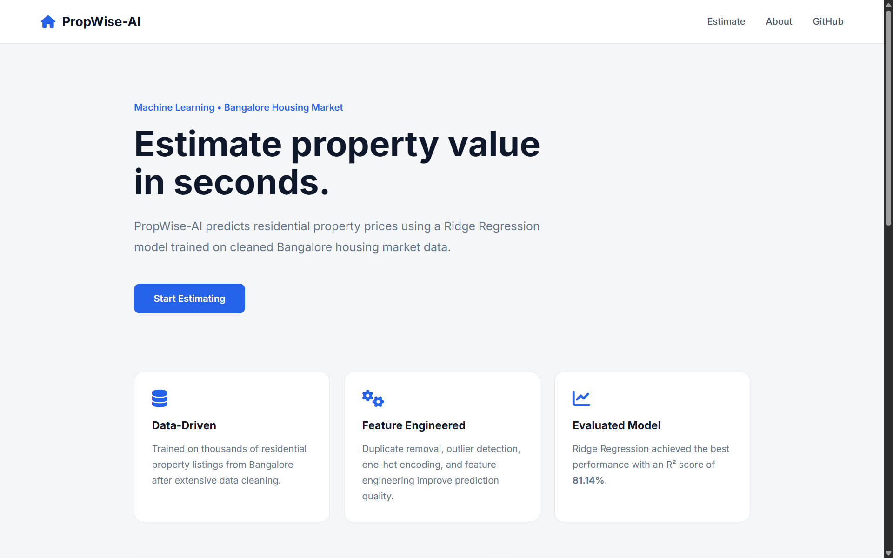
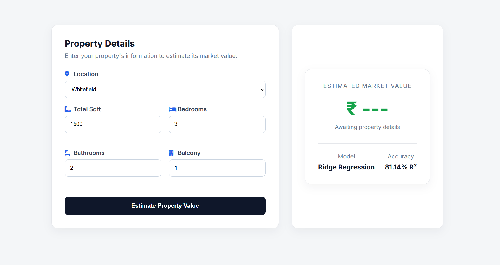
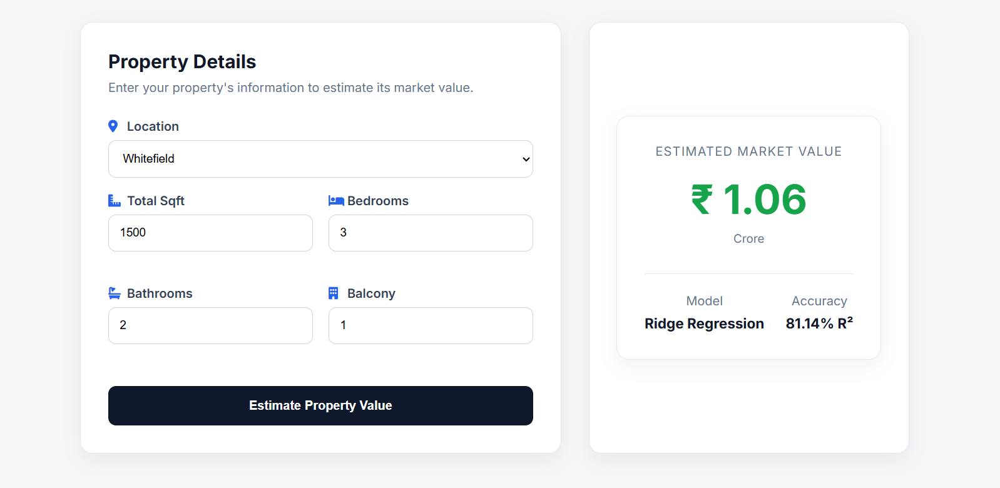

# 🏠 PropWise-AI

> AI-powered property price prediction for Bangalore using Machine Learning and Flask.


---

## 📖 Overview

PropWise-AI is a machine learning web application that estimates residential property prices in Bangalore.

The project includes a complete end-to-end machine learning pipeline, starting from raw dataset preprocessing to model training, evaluation, model selection, serialization, REST API development, and an interactive Flask web interface.

The final prediction model is powered by **Ridge Regression**, selected after comparing multiple regression algorithms.

---

## ✨ Features

- End-to-end ML pipeline
- Data cleaning and preprocessing
- Duplicate removal
- Rare location handling
- Outlier detection
- Feature engineering
- One-Hot Encoding
- Model comparison
- Automatic best model selection
- Model serialization using Joblib
- REST API using Flask
- Responsive web interface
- Real-time property price prediction

---

## 📊 Dataset

The dataset contains residential property listings from Bangalore.

After preprocessing:

| Metric | Value |
|--------|------:|
| Original Records | 13,320 |
| Final Records | 9,851 |
| Locations | 231 |
| Features | 238 |

---

## 🧠 Machine Learning Pipeline

```
Raw Dataset
      │
      ▼
Data Cleaning
      │
      ▼
Feature Engineering
      │
      ▼
Outlier Detection
      │
      ▼
One-Hot Encoding
      │
      ▼
Train/Test Split
      │
      ▼
Model Training
      │
      ▼
Model Evaluation
      │
      ▼
Best Model Selection
      │
      ▼
Model Serialization
      │
      ▼
Flask API
      │
      ▼
Prediction
```

---

## 📈 Model Performance

| Model | R² Score | MAE | RMSE |
|------|---------:|---------:|---------:|
| Linear Regression | 0.8061 | 20.6513 | 40.0303 |
| Lasso Regression | 0.7765 | 23.2215 | 42.9810 |
| **Ridge Regression ✅** | **0.8114** | **20.4440** | **39.4828** |
| Tuned Decision Tree | 0.7402 | 22.2988 | 46.3386 |

Ridge Regression delivered the best overall performance and was selected as the production model.

---

## 🖥️ Tech Stack

### Backend

- Python
- Flask
- Flask-CORS

### Machine Learning

- Scikit-learn
- Pandas
- NumPy
- Joblib

### Frontend

- HTML5
- CSS3
- JavaScript

---

## 📂 Project Structure

```text
PropWise-AI
│
├── data/
├── docs/
├── models/
│   ├── best_model.joblib
│   └── columns.json
│
├── src/
│   ├── api/
│   ├── data/
│   ├── eda/
│   ├── features/
│   ├── models/
│   ├── outliers/
│   ├── pipelines/
│   ├── prediction/
│   ├── training/
│   └── utils/
│
├── static/
├── templates/
├── tests/
│
├── app.py
├── main.py
├── requirements.txt
└── README.md
```

---

## 🚀 Installation

Clone the repository

```bash
git clone https://github.com/AvadhutVG/PropWise-AI.git

cd PropWise-AI
```

Create a virtual environment

```bash
python -m venv .venv
```

Activate it

Windows

```bash
.venv\Scripts\activate
```

Install dependencies

```bash
pip install -r requirements.txt
```

---

## ▶️ Run Training

```bash
python main.py
```

---

## 🌐 Run Web Application

```bash
python app.py
```

Open

```
http://127.0.0.1:5000
```

---

## 📸 Screenshots

### Homepage



---

### Prediction Form



---

### Prediction Result



## 🚀 Future Improvements

- Random Forest Regression
- XGBoost
- LightGBM
- Prediction confidence score
- Interactive visualizations
- User authentication
- Property recommendation engine

---

## 👨‍💻 Author

**Avadhut Gore**

Built as an end-to-end Machine Learning portfolio project.

---

## 📜 License

This project is licensed under the MIT License.